**Mathematics & Computing · Data Science · AI/ML**

 

&nbsp;

---

**✦ ABOUT ME**

I'm a **3rd Year Mathematics & Computing student at MITS Gwalior**, exploring the intersection of **Data Science, Artificial Intelligence and problem solving**.

I enjoy turning ideas into working projects — from experimenting with data to building AI-powered applications and competing in hackathons.

Currently going deeper into **Data Science, Machine Learning and AI**, while continuing to contribute, build and learn in public.

---

**⚡ WHAT I'M UP TO**

<table>
<tr>
<td width="50%">

**📊 Data Science**

Data cleaning, exploratory analysis, visualization and finding meaningful patterns in data.

</td>

<td width="50%">

**🤖 AI / ML**

Exploring machine learning, NLP and practical AI applications.

</td>
</tr>

<tr>
<td width="50%">

**🧠 Problem Solving**

Strengthening DSA, programming fundamentals and analytical thinking.

</td>

<td width="50%">

**🌍 Open Source**

Contributing to open-source projects through **GSSoC 2026**.

</td>
</tr>
</table>

---

**🏆 A HIGHLIGHT FROM THE BUILD JOURNEY**

**🥈 1st Runner-Up — Black-Box Protocol Hackathon**

`750+ Teams` → `Top 50 Finalists` → `🥈 Podium`

**⚖️ NyayaSarthi**

An AI-powered legal-tech project built with my team to explore how technology can make legal assistance more accessible.

**Result:** `1st Runner-Up`

---

**💼 EXPERIENCE**

<table>
<tr>
<td width="12%" align="center">

`01`

</td>
<td>

**Flyrank AI** · AI/ML Intern  
`Jul 2026 — Present`

Working on AI/ML-focused tasks and gaining hands-on experience with applied machine learning and real-world problem solving.

</td>
</tr>

<tr>
<td width="12%" align="center">

`02`

</td>
<td>

**InAmigos Foundation** · AI Intern  
`Aug 27, 2026 — Present`

Working on practical AI applications and contributing to project-based development.

</td>
</tr>
</table>

---

**🚀 PROJECTS**

<table>
<tr>

<td width="50%" valign="top">

**🧠 MindMate AI**

*AI Mental Wellness Web App*

An AI-powered conversational application combining AI and voice interaction.

**My contribution**
- Backend API integration
- Deployment
- External AI service integration

`Gemini` `ElevenLabs` `APIs`

</td>

<td width="50%" valign="top">

**⚖️ NyayaSarthi**

*AI × Legal Technology*

A hackathon project exploring AI-assisted legal accessibility.

🏆 **1st Runner-Up**

`AI` `LegalTech` `Hackathon`

</td>

</tr>

<tr>

<td width="50%" valign="top">

**📊 Excel Gradebook**

*Data & Analytics*

A student gradebook project exploring structured data handling and Excel-based analysis.

`Excel` `Data`

</td>

<td width="50%" valign="top">

**🧪 More Experiments**

Constantly experimenting with new ideas, technologies and problem statements.

Explore my repositories to see what I'm currently building.

</td>

</tr>
</table>

---

**🌍 OPEN SOURCE & COMMUNITY**

**GirlScript Summer of Code 2026**  
`Contributor` · `Campus Ambassador`

♟️ **Zapp Chess** · Campus Ambassador  
🎓 **Unlox Academy** · Campus Ambassador

---

**🛠️ TECH I WORK WITH**

 

`Pandas` · `NumPy` · `Matplotlib` · `Scikit-learn` · `SQL`

 

`Jupyter Notebook` · `Tableau` · `Excel` · `MATLAB`

 

`Data Cleaning` · `EDA` · `Data Visualization` · `NLP` · `Machine Learning`

---

**📚 CURRENTLY LEARNING**

`DATA SCIENCE` · `MACHINE LEARNING` · `AI / NLP` · `DSA`

I'm interested in **understanding technologies well enough to build something useful.**

---

**📈 GITHUB ACTIVITY**

---

**🎓 CERTIFICATIONS**

`AWS Fundamentals of AI/ML` · `Claude Certification`

---

**BUILD → BREAK → LEARN → BUILD AGAIN**

 

&nbsp;

&nbsp;

  

